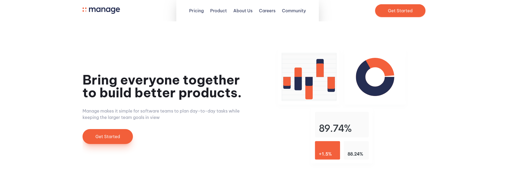

# Frontend Mentor - Manage landing page solution

This is a solution to the [Manage landing page challenge on Frontend Mentor](https://www.frontendmentor.io/challenges/manage-landing-page-SLXqC6P5).

## Table of contents

- [Overview](#overview)
  - [The challenge](#the-challenge)
  - [Screenshot](#screenshot)
  - [Links](#links)
- [My process](#my-process)
  - [Built with](#built-with)
  - [What I learned](#what-i-learned)
- [Author](#author)

## Overview

### The challenge

Users should be able to:

- View the optimal layout for the site depending on their device's screen size
- See hover states for all interactive elements on the page
- See all testimonials in a horizontal slider
- Receive an error message when the newsletter sign up `form` is submitted if:
  - The `input` field is empty
  - The email address is not formatted correctly

### Screenshot



### Links

- Live Site URL: [manage-landing-page](https://manage-landing-page-master-xi.vercel.app)

## My process

### Built with

- Semantic HTML5 markup
- Tailwindcss
- Flexbox
- CSS Grid
- Mobile-first workflow

### What I learned

I learned how to use Tailwindcss.

One of the most interesting things about using it was being able to extend the styles.

```js
module.exports = {
  content: ["./**/*.html"],
  theme: {
    extend: {
      fontFamily: {
        primary: ["Be Vietnam Pro", "sans-serif"],
      },
      colors: {
        "bright-red": "hsl(12, 88%, 59%)",
        "dark-blue": "hsl(228, 39%, 23%)",
        "dark-grayish-blue": "hsl(227, 12%, 61%)",
        "very-dark-blue": "hsl(233, 12%, 13%)",
        "very-pale-red": "hsl(13, 100%, 96%)",
        "very-light-gray": "hsl(0, 0%, 98%)",
      },
      backgroundImage: {
        "close-menu": "url('../images/icon-close.svg')",
        "open-menu": "url('../images/icon-hamburger.svg')",
      },
    },
  },
  plugins: [],
};
```

Here, set a custom font family and new colors.

Another thing was being able to add custom classes, either using the Tailwindcss utility classes with the @apply directive so I could apply the styles to my custom class or adding my own styles.

```css
@layer components {
  .wrapper {
    @apply w-[90%] mx-auto overflow-hidden max-w-screen-xl;
  }

  .button {
    @apply bg-bright-red text-very-light-gray block w-max py-4 px-12 rounded-full;
  }

  .footer-area {
    grid-template-areas:
      "form"
      "navigation"
      "social-media"
      "logo"
      "copyright";
  }

  .footer-area-md {
    grid-template-areas:
      "logo navigation form"
      "social-media navigation copyright";
  }
}
```

## Author

- Frontend Mentor - [@MielAndMoon](https://www.frontendmentor.io/profile/MielAndMoon)
